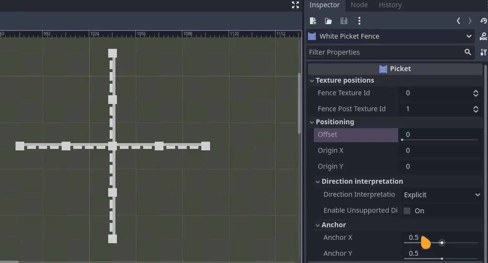
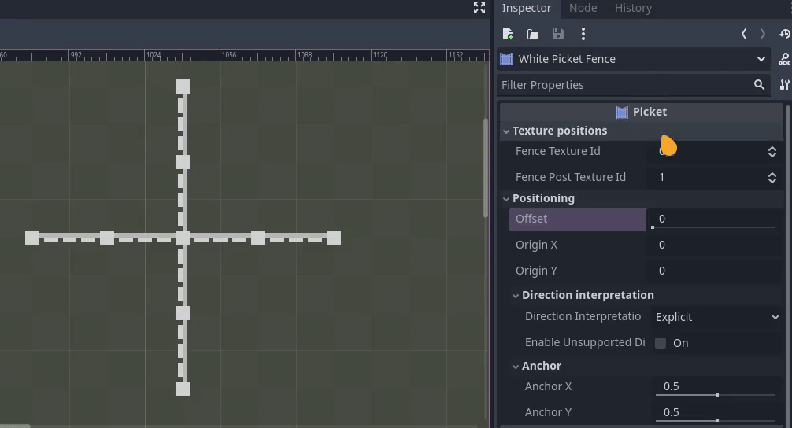

	

---

A simple fence plugin for [Godot Engine](https://godotengine.org/) 4.x. **Makes the building of fences easy, and dynamic.**

## 🤔 Why?

I created this plugin for use in a small game project I'm working on. I wanted to have a simple and flexible solution for drawing fences that auto-connect, and could not find any simple solutions. Such solutions may exist, but Google (as usual these days) failed me, so I decided to implement it myself. *If anything, I learnt something from it :)*

## ⚙️ Installation
### 💚 Easy
This will be the easiest method, if you don't mind updating manually
1. Download [the latest release](https://github.com/mikael-ros/picket/releases)
2. Open or extract the ``.zip``
3. Copy folder to the ``/addons/`` folder of your Godot project
> [!CAUTION]
> Make sure to preserve parent directory. Path should be ``/addons/Picket``, or similar
4. In the Godot Editor, click ``Project`` -> ``Project Settings`` -> ``Plugins`` -> Click the ``Enable`` tick next to the **Picket** plugin

### 🧠 Advanced, but flexible
> [!WARNING]
> I cannot guarantee the below working as expected, I have only recently began utilizing this methodology during development of this addon, I utilized a slightly advanced function within [git](https://git-scm.com/), [submodules](https://git-scm.com/book/en/v2/Git-Tools-Submodules). The benefit of this, I believe, is that you can simply ``git submodule update --remote`` to fetch upstream changes.
1. In your project directory, ``git init``, if you do not already have a git repository
2. Create the ``/addons/Picket/`` directory
3. Execute ``git submodule add git@github.com:mikael-ros/picket.git /addons/Picket``
4. In the Godot Editor, click *"Project"* -> *"Project Settings"* -> *"Plugins"* -> Click the ``Enable`` tick next to the **Picket** plugin

## 🛠️ Usage

### 🖼️ Texture
> [!NOTE]
> This plugin has only been developed with 1:1 aspect ratio in mind. Other ratios may work, but are not officially supported

This plugin uses two separate textures; one for your fence, and one for the posts. 

#### Post texture
Post should be centered in the middle of it's texture, but can be of any size you like.

#### Fence texture
Should be centered vertically, and should take up the width of the texture.

### ⚡ Minimal setup
1. Add the **Picket** node to your scene

	
2. Add a [**TileSet**](https://docs.godotengine.org/en/stable/classes/class_tileset.html) in the properties of **Picket**

	
3. In the *"Tile Set"* tab, add the two textures. Ideally, fence first, post second
	> note: if textures are not in that order, change the indices in the *Texture positions* tab of **Picket**.

	
4. In the *"Tile Map"* tab, paint tiles as you normally would

	

### 📂 Using the demo
Load [``demo.tscn``](/demo/demo.tscn) into a Godot project where you have installed and enabled **Picket**.

### ✨ Advanced features
#### ⚓ Anchors
You can adjust the position at which the fences intersect. This shifts the position, and can be useful if you want to have padding. 

> [!TIP]
> If you still want to adjust the position manually, use the *Origin* positions. Any adjustment of the normal *Position* vector will be overwritten otherwise.

#### 📍 Offset
You can adjust where in the tile the posts are placed. The addon will dynamically fill in posts where absent, so spacing is consistent.

#### 🔁 Rotation
You can rotate the fence direction by first enabling *Positioning* -> *Direction interpretation* -> ``Direction interpretation mode``

Additionally, you can enable "unsupported" rotation (eg. rotation that is 90 degrees or 270 degrees) by ticking the corresponding box. These are regarded as "unsupported" because they look weird, but may be useful in certain situations.

##### 🔂 Explicit rotation mode
This is the only supported rotation mode at the moment. Fence is rotated by using the controls in the Tile Map editor. 

> [!NOTE]
> At the moment, there is no preview for rotation, as this is difficult to implement.

### 🧩 Current limitations and feature suggestions
Currently, tile shapes are not supported beyond *"Square"*. Non-uniform fences aren't supported yet either, so fences can only be straight.

If you desire certain functionality within this plugin, or encounter a bug, feel free to [add an issue](https://github.com/mikael-ros/picket/issues/new) and I will get around to it when time allows - or you can contribute it yourself, see the [contribution guidelines](/CONTRIBUTING.md) 

## 💾 Short technical description
This plugin reads the tile map data, and paints five offset child [**TileMapLayer**](https://docs.godotengine.org/en/stable/classes/class_tilemaplayer.html)s. Two for the fences - one for vertical connections and one for horizontal connections - and three for the posts (vertical, horizontal, and stationary).

The cursor exists on another temporary layer, which only exists in the editor. While this could just have been a sprite, the idea is to permit future preview implementations.

While the amount of layers may seem excessive, this is necessary for offsets and anchors to work. If you'd like, you're welcome to contribute a better solution :)

For more technical details, read the code contained in this repository.
